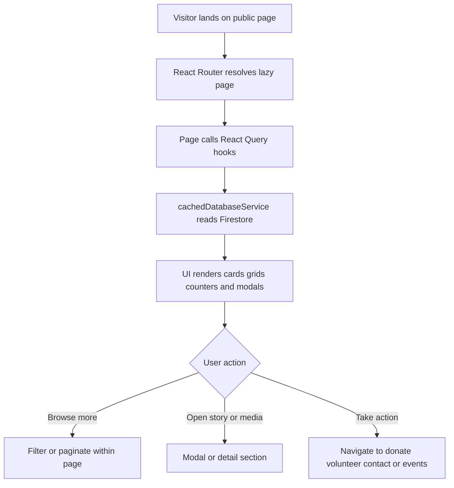

# Module 1: Public Information and Storytelling

| VERSION | DATE | CREATOR | REVIEWER | ORGANIZATION |
|---------|------|---------|----------|--------------|
| 1.0 | 2026-03-09 | GitHub Copilot | TBD | Educare (Dada Chi Shala) Educational Trust |

## 1. Overview

### Business purpose in plain language

This module presents the public identity of Dada Chi Shala. It helps visitors understand the mission, see proof of impact, browse media, read stories, and build trust before deciding to volunteer, donate, or contact the organization.

### What the component does

- Renders the homepage and informational pages for the organization.
- Displays achievements, stories, media, team highlights, and selected upcoming events.
- Surfaces trust-building content such as testimonials, blogs, awards, and news.
- Uses SEO metadata and structured data to improve discoverability.
- Pulls content from Firestore through shared query hooks and cached service functions.

### When it executes

- On navigation to public routes such as `/`, `/about`, `/gallery`, `/team`, and `/media`.
- On initial application load when route-level lazy loading resolves the requested page.
- When users switch categories, open content modals, or revisit the tab and React Query refetches data.

## 2. Components

### 2.1 Business Overview

This module is the digital storefront of the NGO. It is optimized for discovery and trust formation rather than transaction processing. The content is mostly read-only for public users, but its freshness depends on admin-maintained records in Firestore.

### 2.1.1 Process Flow

#### Public content journey

#### Detailed user journey

1. A visitor enters a public route from direct URL, search engine, or internal navigation.
2. `App.jsx` resolves the route and loads the page lazily.
3. The page calls one or more React Query hooks such as `useUpcomingEvents`, `useGalleryItems`, `useBlogs`, `useSuccessStories`, `useTestimonials`, or `useTeamMembers`.
4. The hook delegates to `cachedDatabaseService.js`, which fetches Firestore data and returns normalized arrays with document IDs.
5. The UI renders cards, counters, carousels, blog previews, or image/video grids.
6. The visitor may open a modal, switch a category filter, or navigate to a deeper public page.
7. If the visitor is convinced to act, they continue to donation, volunteer, or contact workflows owned by other modules.

### 2.1.2 Functional Requirements

| ID | Requirement | Acceptance Criteria | Business Rules |
|----|-------------|--------------------|----------------|
| FR-PS-01 | The system must render public landing and informational pages. | Pages load through route navigation without authentication. | Public content must remain accessible unless global maintenance mode is active. |
| FR-PS-02 | The system must show curated impact and media content from the database. | Gallery, stories, testimonials, blogs, awards, and media render from Firestore-backed data. | Most recent records should appear first where configured. |
| FR-PS-03 | The system must expose a subset of upcoming events on the public experience. | Homepage and related sections display upcoming events ordered by event date ascending. | Upcoming means event date greater than or equal to today. |
| FR-PS-04 | The system must support category-based media browsing. | Users can filter gallery or media content by category without leaving the page context. | Category semantics depend on the stored `category` field in Firestore. |
| FR-PS-05 | The system must support content discovery through metadata. | SEO metadata and optional structured data are rendered on key public pages. | Admin pages should not be indexed, but public pages should be discoverable. |

### 2.1.3 Non-Functional Requirements

- Performance: Public pages should load via lazy routing and avoid downloading admin code upfront.
- Data freshness: React Query should refetch on mount, reconnect, and window focus.
- Resilience: If analytics initialization fails, the application should continue normally.
- Scalability: Firestore query patterns should support ordering on date or timestamp fields.
- Usability: Media and story content should render across desktop and mobile layouts.

### 2.1.4 Technical Breakdown

#### Component and file structure

Main files:
- `src/pages/HomePage.jsx`
- `src/pages/AboutPage.jsx`
- `src/pages/GalleryPage.jsx`
- `src/pages/TeamPage.jsx`
- `src/pages/MediaPage.jsx`

Primary child components:
- `src/components/AnimatedCounter.jsx`
- `src/components/BlogCard.jsx`
- `src/components/BlogModal.jsx`
- `src/components/EventCard.jsx`
- `src/components/GalleryGrid.jsx`
- `src/components/gallery/GalleryItemCard.jsx`
- `src/components/stories/StoryTestimonialCard.jsx`
- `src/components/team/TeamMemberCard.jsx`
- `src/components/SEO.jsx`

Supporting direct and indirect dependencies:
- `src/hooks/useFirebaseQueries.js`
- `src/services/cachedDatabaseService.js`
- `src/services/cacheService.js`
- `src/utils/formatters.js`
- `src/utils/helpers.js`
- `src/utils/colorUtils.js`
- `src/config/queryClient.jsx`

#### Methods, public methods, and on-load behavior

- Public methods are primarily React function components and exported React Query hooks.
- Page load triggers query execution through hooks, not imperative service calls in most cases.
- `SEO.jsx` injects metadata on render.
- `AnimatedCounter.jsx` executes when counters enter view and animates numeric progression.

#### Imported functions

Representative imported functions include:
- `useUpcomingEvents`, `useGalleryItems`, `useBlogs`, `useSuccessStories`, `useTestimonials`
- `getGalleryItems`, `getBlogs`, `getSuccessStories`, `getTestimonials`, `getAwards`, `getNewsArticles`, `getVideos`
- Formatting helpers for display-safe rendering

#### Security considerations

- This module is public by design and should never depend on admin authentication.
- User-generated or admin-authored content should be sanitized before storage; display assumes source data is already cleaned.
- SEO metadata should not expose secrets or internal admin URLs.
- Media assets should be served through Firebase Storage or safe external URLs.

#### Performance analysis

- Route-level lazy loading reduces initial bundle size.
- React Query caches repeated reads and refetches on visibility changes.
- Gallery, blog, and story content use recent-first query patterns suitable for browsing.
- Image-heavy pages remain sensitive to media size and CDN/storage optimization.

## 3. Related Objects and Automation

### All DB related operations

- Read from `gallery`
- Read from `success_stories`
- Read from `testimonials`
- Read from `blogs`
- Read from `awards`
- Read from `news`
- Read from `videos`
- Read from `events`
- Read from `team`

### Primary tables involved

Firestore collections:
- `gallery`
- `success_stories`
- `testimonials`
- `blogs`
- `awards`
- `news`
- `videos`
- `events`
- `team`

### Child records created

This module does not create records directly in normal public usage. All content creation happens through admin modules.

## 4. Impacted Components

### All files impacted directly and indirectly

Direct page files:
- `src/pages/HomePage.jsx`
- `src/pages/AboutPage.jsx`
- `src/pages/GalleryPage.jsx`
- `src/pages/TeamPage.jsx`
- `src/pages/MediaPage.jsx`

Shared UI and display components:
- `src/components/AnimatedCounter.jsx`
- `src/components/BlogCard.jsx`
- `src/components/BlogModal.jsx`
- `src/components/EventCard.jsx`
- `src/components/GalleryGrid.jsx`
- `src/components/gallery/GalleryItemCard.jsx`
- `src/components/stories/StoryTestimonialCard.jsx`
- `src/components/team/TeamMemberCard.jsx`
- `src/components/Navbar.jsx`
- `src/components/Footer.jsx`
- `src/components/SEO.jsx`

Supporting service and hook files:
- `src/hooks/useFirebaseQueries.js`
- `src/services/cachedDatabaseService.js`
- `src/services/cacheService.js`
- `src/config/queryClient.jsx`
- `src/App.jsx`

### Impact analysis

- Any schema change in content collections will impact public pages immediately after query refresh.
- Changes to shared cards or modal components can affect multiple public pages at once.
- Altering cache TTLs changes perceived freshness and Firestore read volume.
- SEO or routing changes in infrastructure will change discoverability and entry traffic behavior.

## 5. For Administrators / Technical Teams

### Configuration requirements

- Firebase environment variables must be configured in `.env` for Firestore access.
- Storage and CDN URLs for images must remain valid.
- Query indexes may be required for ordered public feeds.

### Permissions needed

- Public read permissions on approved content collections.
- Admin write permissions are required only in content-management modules, not here.

### Debug queries

- Verify gallery ordering by `uploaded_at desc`.
- Verify event selection with `event_date >= today` and `orderBy event_date asc`.
- Verify blog ordering by `created_at desc`.
- Verify team ordering by `order asc` with fallback logic when ordering fails.

### Debug log setup instructions

- Browser console logs are sufficient for this module in current implementation.
- React Query devtools are not wired in repository code; debugging depends on network traces and console output.
- Watch for Firestore index errors returned in browser console during query execution.

### Common system issues

- Empty sections caused by missing Firestore data.
- Broken images caused by invalid storage URLs.
- Incorrect ordering caused by missing timestamps or fields.
- Public page staleness caused by cached content not yet invalidated by admin actions.

### Troubleshooting steps

1. Confirm Firebase environment variables are present and valid.
2. Check browser console for Firestore permission or index errors.
3. Validate documents contain expected fields such as `created_at`, `uploaded_at`, `category`, and `order`.
4. Clear local cache through `cacheService.clearAll()` or hard refresh the page.
5. Confirm the relevant admin module has published current content to the expected collection.
