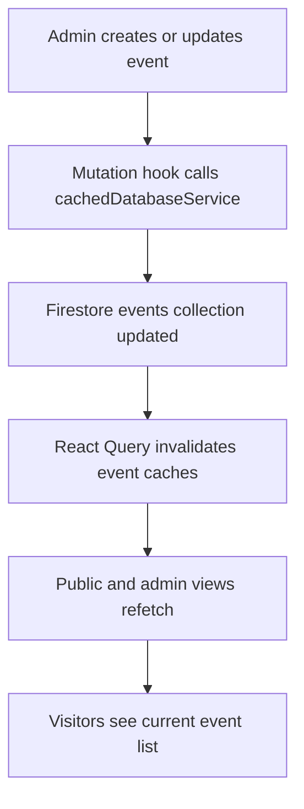

# Module 2: Events Management

| VERSION | DATE | CREATOR | REVIEWER | ORGANIZATION |
|---------|------|---------|----------|--------------|
| 1.0 | 2026-03-09 | GitHub Copilot | TBD | Educare (Dada Chi Shala) Educational Trust |

## 1. Overview

### Business purpose in plain language

This module helps the organization promote upcoming programs and keep the community informed about scheduled activities. It supports both public event discovery and admin maintenance of the event calendar.

### What the component does

- Lists events for public users.
- Shows upcoming events on the homepage and events page.
- Allows admins to create, edit, and delete event records.
- Uses shared query hooks and cache invalidation to keep event data current.

### When it executes

- On navigation to `/events`.
- On homepage rendering when a subset of upcoming events is requested.
- On admin dashboard access to the Events tab.
- On every event CRUD action initiated by an authenticated admin.

## 2. Components

### 2.1 Business Overview

Events are a program-delivery and engagement mechanism. The business requirement is to maintain one source of truth for scheduled activities while exposing the same data differently for public awareness and internal management.

### 2.1.1 Process Flow

#### Step-by-step user journey

1. An admin opens the Events tab inside the dashboard.
2. `EventManagement.jsx` renders existing records using `useEvents()`.
3. The admin opens `EventForm.jsx` for create or update.
4. Form submission calls `useAddEvent()` or `useUpdateEvent()`.
5. `cachedDatabaseService.js` writes to the `events` collection and stamps timestamps.
6. Query caches for `events` and `upcomingEvents` are invalidated.
7. Public pages refetch and display updated event cards in ascending event-date order.
8. A public visitor browsing `/events` or the homepage sees the refreshed schedule.

### 2.1.2 Functional Requirements

| ID | Requirement | Acceptance Criteria | Business Rules |
|----|-------------|--------------------|----------------|
| FR-EV-01 | The system must list all event records for public users. | `/events` renders records returned from Firestore without admin login. | Event order must be ascending by `event_date`. |
| FR-EV-02 | The system must show upcoming events separately. | Homepage or limited views show only events on or after the current day. | Default upcoming limit is 3. |
| FR-EV-03 | Admin users must be able to create new events. | A successful form submission writes an `events` document and becomes visible after refetch. | `created_at` and `updated_at` are stamped on create. |
| FR-EV-04 | Admin users must be able to update existing events. | Updated content is visible after cache invalidation and refetch. | `updated_at` must be refreshed on modification. |
| FR-EV-05 | Admin users must be able to delete events. | Deleted events no longer appear in event lists after invalidation. | Deletion is hard delete in current implementation. |

### 2.1.3 Non-Functional Requirements

- Performance: Event queries should remain lightweight and index-backed.
- Reliability: Failed event mutations should surface errors without corrupting existing UI state.
- Freshness: Cache invalidation should refresh both full and upcoming event lists.
- Compatibility: Public listing and admin editing must use one shared schema.

### 2.1.4 Technical Breakdown

#### Component and file structure

Entry files:
- `src/pages/EventsPage.jsx`
- `src/components/EventManagement.jsx`

Child files:
- `src/components/EventCard.jsx`
- `src/components/EventForm.jsx`
- `src/components/EventDetails.jsx`

Supporting files:
- `src/hooks/useFirebaseQueries.js`
- `src/services/cachedDatabaseService.js`
- `src/services/cacheService.js`
- `src/utils/helpers.js`
- `src/utils/validators.js`
- `src/components/common/*`

#### Methods, public methods, and on-load behavior

Exported hooks used by this module:
- `useEvents(limitCount)`
- `useUpcomingEvents(limitCount)`
- `useAddEvent()`
- `useUpdateEvent()`
- `useDeleteEvent()`

Underlying service methods:
- `getEvents()`
- `getUpcomingEvents()`
- `addEvent()`
- `updateEvent()`
- `deleteEvent()`

On load:
- Public pages load event lists through query hooks.
- Admin pages load current events and render forms conditionally.

#### Imported functions

- Firestore query helpers through `cachedDatabaseService.js`
- React Query mutation and invalidation helpers through custom hooks
- Date formatting helpers from shared utilities

#### Security considerations

- Public event reading is open by design.
- Event creation and deletion must remain admin-only via protected admin routing and backend rules.
- Without verified Firestore rules in repository, the database must be reviewed separately for write protection.

#### Performance analysis

- `getUpcomingEvents()` uses `where('event_date', '>=', today)` and `orderBy('event_date', 'asc')`, which typically requires a compatible Firestore index.
- Event cache invalidation is targeted and efficient.
- Admin updates are simple documents and should scale well unless rich media or attendee logic is later introduced.

## 3. Related Objects and Automation

### All DB related operations

- Read `events` ordered by `event_date asc`
- Read filtered upcoming `events`
- Insert new `events` documents
- Update existing `events` documents
- Delete existing `events` documents

### Primary tables involved

Firestore collections:
- `events`

Key fields observed:
- `event_date`
- `created_at`
- `updated_at`
- Title and description fields as consumed by UI components

### Child records created

- No child collections are created by the event flow.
- Query invalidation of `events` and `upcomingEvents` acts as follow-on automation in the client.

## 4. Impacted Components

### All files impacted directly and indirectly

Direct files:
- `src/pages/EventsPage.jsx`
- `src/components/EventManagement.jsx`
- `src/components/EventForm.jsx`
- `src/components/EventCard.jsx`
- `src/components/EventDetails.jsx`

Indirect files:
- `src/pages/HomePage.jsx`
- `src/hooks/useFirebaseQueries.js`
- `src/services/cachedDatabaseService.js`
- `src/services/cacheService.js`
- `src/pages/AdminDashboard.jsx`
- `src/components/ProtectedRoute.jsx`
- `src/config/queryClient.jsx`

### Impact analysis

- Schema changes in `events` affect both public and admin views simultaneously.
- Any modification to event hook names or query keys will impact invalidation logic.
- Homepage regressions can occur if upcoming-event logic changes or returns empty data.
- If event-date formatting or validation changes, both form entry and public display behavior are affected.

## 5. For Administrators / Technical Teams

### Configuration requirements

- Firestore collection `events` must exist or be creatable by service account or authorized client.
- Query indexes must support the `where + orderBy` combination for upcoming events.

### Permissions needed

- Public read access for published event data.
- Authenticated admin write access for create, update, and delete operations.

### Debug queries

- `events orderBy event_date asc`
- `events where event_date >= today orderBy event_date asc limit 3`

### Debug log setup instructions

- Check browser console for Firestore permission-denied or failed-precondition errors.
- Monitor mutation failures in the console because mutation hooks log errors through React Query defaults.

### Common system issues

- Missing Firestore index for upcoming-event queries.
- Empty public listing caused by incorrectly formatted `event_date` values.
- Admin save succeeds visually but data appears stale because refetch has not yet completed.

### Troubleshooting steps

1. Confirm documents in `events` contain parsable `event_date` values.
2. Verify Firestore index support when `where` and `orderBy` are combined.
3. Confirm the admin user can reach the dashboard through authenticated routing.
4. Check that query invalidation occurs after mutations.
5. Hard refresh the app if stale local cache is suspected.
