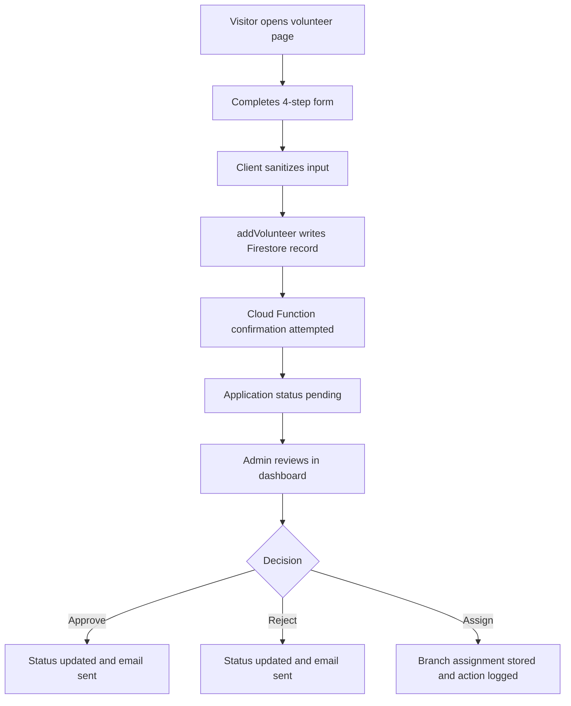

# Module 3: Community Engagement, Volunteers, and Branches

| VERSION | DATE | CREATOR | REVIEWER | ORGANIZATION |
|---------|------|---------|----------|--------------|
| 1.0 | 2026-03-09 | GitHub Copilot | TBD | Educare (Dada Chi Shala) Educational Trust |

## 1. Overview

### Business purpose in plain language

This module converts interested visitors into active contributors. It allows people to volunteer, helps them understand available branch locations, and gives administrators tools to review applications, communicate decisions, and assign volunteers to branches.

### What the component does

- Captures volunteer applications through a four-step public form.
- Shows branch information so applicants understand where and how they can contribute.
- Stores volunteer records in Firestore.
- Supports volunteer review, approval, rejection, assignment, and action-history logging for admins.
- Sends volunteer-related notifications through EmailJS and Firebase Functions.

### When it executes

- On navigation to `/volunteer` and `/branches`.
- When a visitor progresses through the volunteer form.
- When admin users open the Volunteers or Branches tabs in the dashboard.
- When status changes or branch assignments are performed by admins.

## 2. Components

### 2.1 Business Overview

The business objective is to bring volunteers into the organization in a structured way while keeping branch data visible and manageable. The module combines recruitment, branch discovery, and volunteer operations into one engagement lifecycle.

### 2.1.1 Process Flow

#### Step-by-step user journey

1. A public user visits `/volunteer`.
2. The UI collects personal information, skills, preferences, availability, and motivation across four steps.
3. Before submission, required fields are validated and key text inputs are sanitized.
4. `addVolunteer()` writes a structured Firestore document into `volunteers`.
5. The page attempts to call the `sendVolunteerConfirmation` Cloud Function.
6. The user receives a success or failure status message in the UI.
7. An admin later opens `VolunteerManagement.jsx` from the dashboard.
8. The admin reviews submissions by status, updates the application decision, and can assign a branch.
9. Additional actions are appended to `action_history` and notification emails are triggered.
10. Branch records maintained in `branches` support browsing and assignment decisions.

### 2.1.2 Functional Requirements

| ID | Requirement | Acceptance Criteria | Business Rules |
|----|-------------|--------------------|----------------|
| FR-CE-01 | The system must allow public users to submit volunteer applications. | Four-step form saves a volunteer record in Firestore and shows a submission outcome. | Required fields must be completed before final submission. |
| FR-CE-02 | The system must store volunteer applications in structured sections. | Firestore document includes `personal_info`, `skills_and_interests`, `availability`, `experience_and_motivation`, and `references_and_emergency`. | New records begin with pending status. |
| FR-CE-03 | The system must allow admins to review volunteer applications by status. | Admin dashboard displays volunteer lists and supports decision workflows. | Status fields should remain synchronized where both `application_status` and `status` are used. |
| FR-CE-04 | The system must allow branch assignment after review. | Assigned branch and coordinator email are saved on the volunteer record. | Assignment should create an auditable action-history entry. |
| FR-CE-05 | The system must allow visitors to browse branch information. | Branch cards render location, timing, and related display information. | Branch content is public-facing. |

### 2.1.3 Non-Functional Requirements

- Data privacy: Personal volunteer data must be limited to admin-visible workflows.
- Reliability: Email failures must not block successful application submission.
- Usability: Multi-step navigation must preserve entered state while progressing between steps.
- Performance: Volunteer and branch lists should refresh quickly after admin actions.
- Maintainability: Branch and volunteer logic should remain separable even though they are documented together.

### 2.1.4 Technical Breakdown

#### Component and file structure

Public entry files:
- `src/pages/VolunteerPage.jsx`
- `src/pages/BranchesPage.jsx`

Admin entry files:
- `src/components/VolunteerManagement.jsx`
- `src/components/BranchManagement.jsx`

Child and related files:
- `src/components/BranchCard.jsx`
- `src/components/common/FormInput.jsx`
- `src/components/common/Modal.jsx`
- `src/components/common/Button.jsx`
- `src/components/ImageUpload.jsx`

Supporting direct and indirect dependencies:
- `src/hooks/useFirebaseQueries.js`
- `src/services/cachedDatabaseService.js`
- `src/services/emailService.js`
- `src/services/imageUploadService.js`
- `src/services/firebase.js`
- `src/utils/validators.js`
- `src/utils/sanitization.js`
- `functions/index.js`

#### Methods, public methods, and on-load behavior

Key exported hooks and functions:
- `useVolunteers()`
- `useVolunteersByStatus(status)`
- `useBranches()`
- `useAddBranch()`
- `useUpdateBranch()`
- `useDeleteBranch()`
- `addVolunteer()`
- `updateVolunteerStatus()`
- `assignVolunteerToBranch()`
- `addVolunteerAction()`
- `sendVolunteerEmail()`

On load behavior:
- Volunteer page initializes step state and optional testimonial content.
- Branch page loads branch records for public display.
- Admin volunteer and branch screens load current records and enable mutation flows.

#### Imported functions

- Firestore CRUD via `cachedDatabaseService.js`
- Cloud function invocation via `httpsCallable(functions, 'sendVolunteerConfirmation')`
- Email sending via `emailService`
- Validation and sanitization via `sanitizeString` and `sanitizeEmail`

#### Security considerations

- Volunteer submissions contain personal data and should be protected by Firestore rules.
- Admin review features depend on client-side route protection and should be reinforced with backend authorization.
- EmailJS configuration in the client is operationally sensitive and should be governed carefully.
- Branch image uploads require secure Storage write rules.

#### Performance analysis

- Volunteer writes are lightweight single-document inserts.
- Admin volunteer dashboards can become heavier as record count grows because status filtering is query-based and history arrays grow per record.
- Branch reads are inexpensive and suitable for public display.
- Email and function calls are asynchronous and intentionally non-blocking for some flows.

## 3. Related Objects and Automation

### All DB related operations

- Insert into `volunteers`
- Read all `volunteers`
- Read `volunteers` by `application_status`
- Update volunteer status fields
- Update volunteer branch assignment and coordinator email
- Append volunteer `action_history`
- Read `branches`
- Insert, update, and delete `branches`

### Primary tables involved

Firestore collections:
- `volunteers`
- `branches`
- Potential related storage paths for uploaded images

Relevant document structures:
- Volunteer sub-objects for personal info, skills, availability, experience, references, and emergency contacts
- Branch metadata including branch name, location, timings, student count, team members, and image URL

### Child records created

- `action_history` entries are appended as child array elements inside volunteer records.
- Confirmation and status emails are triggered as automation, not stored as independent Firestore child collections in visible code.

## 4. Impacted Components

### All files impacted directly and indirectly

Direct files:
- `src/pages/VolunteerPage.jsx`
- `src/pages/BranchesPage.jsx`
- `src/components/VolunteerManagement.jsx`
- `src/components/BranchManagement.jsx`
- `src/components/BranchCard.jsx`

Indirect files:
- `src/hooks/useFirebaseQueries.js`
- `src/services/cachedDatabaseService.js`
- `src/services/emailService.js`
- `src/services/imageUploadService.js`
- `src/services/firebase.js`
- `src/pages/AdminDashboard.jsx`
- `src/components/ProtectedRoute.jsx`
- `functions/index.js`
- `src/utils/validators.js`
- `src/utils/sanitization.js`

### Impact analysis

- Any volunteer schema change affects public submission, admin review, and email templates together.
- Branch schema changes affect both public discovery and admin assignment workflows.
- Changes to email templates or function names can break post-submission communication while leaving data persistence intact.
- Storage upload changes can disrupt branch management without affecting volunteer submission logic.

## 5. For Administrators / Technical Teams

### Configuration requirements

- Firebase Functions must be deployed for volunteer confirmation where used.
- EmailJS configuration must be valid for client-driven volunteer notifications.
- Firestore must allow the intended read and write paths under secure rules.
- Storage must accept branch image uploads for authorized users.

### Permissions needed

- Public create access only where volunteer submissions are intentionally allowed.
- Restricted admin read and write access for volunteer review and branch maintenance.
- Storage write permission for admin image uploads.

### Debug queries

- `volunteers orderBy submitted_at desc`
- `volunteers where application_status == <status> orderBy submitted_at desc`
- `branches orderBy branch_name asc`

### Debug log setup instructions

- Check browser console during volunteer submission for validation errors and function-call failures.
- Verify EmailJS initialization logs in the browser.
- Inspect Firebase Functions logs for volunteer confirmation failures.

### Common system issues

- Volunteer submissions succeed but confirmation email fails.
- Firestore index missing for volunteer status queries.
- Branch assignment updates one status field but not all dependent fields if logic changes incorrectly.
- Uploaded branch images fail because of Storage permission or file constraints.

### Troubleshooting steps

1. Confirm Firestore receives a volunteer record with nested objects and pending status.
2. Verify the callable function name exists and is deployed.
3. Review EmailJS service, template, and public key configuration.
4. Check Firestore rules and indexes for volunteer status filtering.
5. Validate uploaded files meet image type and size rules where image upload is involved.
