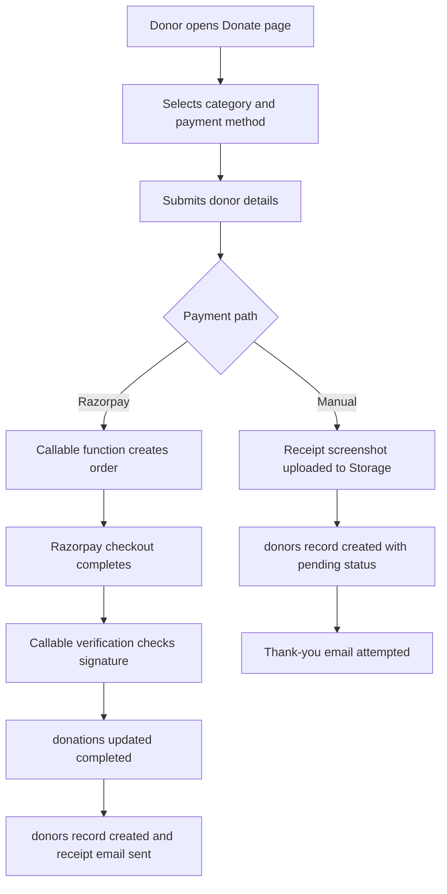

# Module 4: Donations and Fundraising

| VERSION | DATE | CREATOR | REVIEWER | ORGANIZATION |
|---------|------|---------|----------|--------------|
| 1.0 | 2026-03-09 | GitHub Copilot | TBD | Educare (Dada Chi Shala) Educational Trust |

## 1. Overview

### Business purpose in plain language

This module converts goodwill into financial support. It provides donation options, collects donor information, processes online payments through Razorpay, accepts manual transfer evidence, and creates records that the organization can use for finance operations and donor communication.

### What the component does

- Presents donation categories and payment options.
- Collects donor contact and tax-related information.
- Supports Razorpay-based online payments.
- Supports manual transfer flows with screenshot upload.
- Stores donation and donor data in Firestore.
- Uses Cloud Functions for order creation, payment verification, webhook processing, and receipt email delivery.

### When it executes

- On navigation to `/donate`.
- When the Razorpay SDK script is loaded on page initialization.
- When a donor submits the form for online or manual payment.
- When Cloud Functions receive verification or webhook events.
- When admins open the Donations tab in the dashboard.

## 2. Components

### 2.1 Business Overview

This module is the revenue collection workflow of the application. It is the most integration-heavy functional area because it spans frontend forms, file upload, payment gateway orchestration, Firestore persistence, webhook processing, and email receipts.

### 2.1.1 Process Flow

#### Step-by-step user journey

1. The donor opens `/donate` and chooses a funding category.
2. The page preselects an amount and allows the donor to choose online payment or manual transfer.
3. Donor information is collected through React Hook Form.
4. For Razorpay payments, the page ensures the gateway script is ready and calls `initiatePayment()`.
5. The frontend callable function `createRazorpayOrder` creates an order and stores a pending `donations` record.
6. After checkout, `verifyRazorpayPayment` validates the HMAC signature and updates the pending record to completed.
7. The function creates a `donors` document and sends a receipt email.
8. In parallel, the `razorpayWebhook` endpoint can reconcile captured or failed payments.
9. For manual transfer, the user uploads a screenshot that is stored in Firebase Storage and a pending `donors` record is created directly from the frontend.
10. The donor sees a thank-you screen after successful submission.

### 2.1.2 Functional Requirements

| ID | Requirement | Acceptance Criteria | Business Rules |
|----|-------------|--------------------|----------------|
| FR-DF-01 | The system must present predefined donation categories. | Category selection updates displayed amount and funding context. | Categories carry default amounts and frequencies. |
| FR-DF-02 | The system must support online payment through Razorpay. | A valid order is created, checkout opens, and successful payment creates a verified donor record. | Signature verification is mandatory before marking completed. |
| FR-DF-03 | The system must support manual payment evidence upload. | Donor can upload a payment screenshot and create a pending donation record. | Screenshot file types and size are validated client-side. |
| FR-DF-04 | The system must store donor information for finance and receipt processing. | Donor details are saved in Firestore with amount, category, and payment metadata. | Completed gateway payments and manual pending payments follow different storage paths. |
| FR-DF-05 | The system must notify the donor after submission or verification. | Thank-you or receipt communication is attempted via email. | Email failure should not invalidate a successful payment record. |

### 2.1.3 Non-Functional Requirements

- Security: Gateway secret keys must stay server-side.
- Integrity: Payment records must not be marked successful without valid verification.
- Availability: Webhook reconciliation should recover cases where the frontend flow is interrupted.
- Usability: Donation flow should work on mobile and desktop layouts.
- Observability: Payment and email failures should be logged for support teams.

### 2.1.4 Technical Breakdown

#### Component and file structure

Entry files:
- `src/pages/DonatePage.jsx`
- `src/components/DonationManagement.jsx`

Supporting frontend files:
- `src/services/razorpayService.js`
- `src/services/emailService.js`
- `src/services/firebase.js`
- `src/services/cachedDatabaseService.js`
- `src/components/SEO.jsx`
- `src/utils/validators.js`

Backend and automation files:
- `functions/index.js`
- `functions/package.json`

#### Methods, public methods, and on-load behavior

Frontend methods and hooks:
- `loadRazorpayScript()`
- `initiatePayment()`
- `handleRazorpayPayment()`
- `handleManualPayment()`
- `useDonations()`
- `useDonationStats()`

Backend methods:
- `createRazorpayOrder`
- `verifyRazorpayPayment`
- `razorpayWebhook`
- `sendReceiptEmail()`

On load behavior:
- Donate page loads the Razorpay script.
- Donation category selection updates the form amount.
- Thank-you screen replaces the form after successful completion.

#### Imported functions

- Firestore client methods `addDoc`, `collection`
- Storage methods `ref`, `uploadBytes`, `getDownloadURL`
- Callable functions via Firebase Functions
- Validation helpers `sanitizeString` and `sanitizeEmail`

#### Security considerations

- HMAC signature validation is implemented in Cloud Functions for gateway verification.
- Razorpay key secret and webhook secret remain server-side.
- Donor PII such as phone and PAN values are stored and should be protected through strict Firestore rules and retention policies.
- Manual donation screenshot uploads must be restricted and virus-screening may be desirable operationally.
- Client-side email configuration should not be treated as a secure audit mechanism.

#### Performance analysis

- Online payments depend on third-party script load and network round-trips to callable functions.
- Manual flow uploads images before writing the donor record, so slow uploads directly affect submission time.
- Admin stats rely on querying completed donations and may grow more expensive as record volume increases.

## 3. Related Objects and Automation

### All DB related operations

- Create pending `donations` records for Razorpay order creation.
- Update `donations` status to completed or failed.
- Create `donors` records after verified payments.
- Create pending `donors` records for manual payment submissions.
- Read `donors` for admin donation lists.
- Read completed `donations` for statistics.
- Upload manual proof images to Firebase Storage under `donations/...`.

### Primary tables involved

Firestore collections:
- `donations`
- `donors`

Storage areas:
- `donations/<timestamp>_<filename>`

Function-level secrets and configuration:
- `RAZORPAY_KEY_ID`
- `RAZORPAY_KEY_SECRET`
- `RAZORPAY_WEBHOOK_SECRET`
- `EMAIL_USER`
- `EMAIL_PASSWORD`

### Child records created

- Completed Razorpay payments create child business records in `donors` from source `donations` records.
- `receiptSentAt` is added back to the donor record after email dispatch.

## 4. Impacted Components

### All files impacted directly and indirectly

Direct files:
- `src/pages/DonatePage.jsx`
- `src/components/DonationManagement.jsx`
- `src/services/razorpayService.js`
- `functions/index.js`

Indirect files:
- `src/services/firebase.js`
- `src/services/cachedDatabaseService.js`
- `src/services/emailService.js`
- `src/hooks/useFirebaseQueries.js`
- `src/pages/AdminDashboard.jsx`
- `src/components/ProtectedRoute.jsx`
- `src/utils/validators.js`
- `functions/package.json`

### Impact analysis

- Changing donation schema affects frontend entry forms, backend verification, admin reporting, and receipt emails.
- Changes in Cloud Function names or payload contracts will break the payment journey.
- Storage upload rule changes affect only the manual payment path, not Razorpay verification.
- Donor statistics and admin records can diverge if `donations` and `donors` are modified without maintaining the existing relationship.

## 5. For Administrators / Technical Teams

### Configuration requirements

- Firebase Functions must be deployed with Razorpay and email secrets configured.
- Frontend `.env` must contain Firebase keys and any public gateway configuration required by `razorpayService.js`.
- Firebase Storage must be enabled for manual-payment screenshot uploads.

### Permissions needed

- Public users need access to callable payment entry points and manual donation submission path.
- Only backend functions should hold payment secrets.
- Admin users need read access to donation and donor records for management purposes.

### Debug queries

- `donations where status == completed`
- `donations where razorpayOrderId == <order_id> limit 1`
- `donors orderBy createdAt desc`

### Debug log setup instructions

- Review Cloud Functions logs for order creation, signature verification, webhook execution, and email sending.
- Review browser console for Razorpay SDK load failures and manual upload errors.
- Trace network calls to callable functions and webhook endpoints during test payments.

### Common system issues

- Razorpay SDK not loaded before payment submission.
- Signature mismatch due to incorrect secret configuration.
- Manual payment record created without usable screenshot URL because upload failed.
- Donor receipt email fails even though payment succeeds.
- Stats mismatch because some values are read from `donations` while admin lists read from `donors`.

### Troubleshooting steps

1. Validate all function environment variables in the deployed backend.
2. Confirm `createRazorpayOrder` creates a pending `donations` record.
3. Check that `verifyRazorpayPayment` updates the same `donationId` and creates a `donors` entry.
4. Test webhook delivery and signature verification separately from the frontend flow.
5. For manual payments, verify file type, file size, Storage upload success, and generated download URL.
