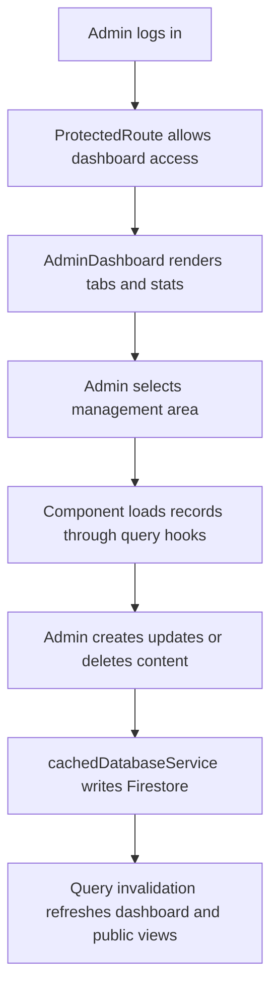

# Module 5: Admin Content Management

| VERSION | DATE | CREATOR | REVIEWER | ORGANIZATION |
|---------|------|---------|----------|--------------|
| 1.0 | 2026-03-09 | GitHub Copilot | TBD | Educare (Dada Chi Shala) Educational Trust |

## 1. Overview

### Business purpose in plain language

This module gives internal staff a single operational workspace to manage the organization's digital content and operational records. It centralizes maintenance of team members, stories, blogs, gallery items, volunteers, branches, donations, and events.

### What the component does

- Renders the admin dashboard shell and tabbed management experience.
- Provides CRUD interfaces for multiple content collections.
- Displays lightweight operational metrics for dashboard context.
- Uses protected routing and shared modal/form components.
- Invalidates query caches after successful mutations so public pages reflect current content.

### When it executes

- On successful navigation to `/admin/dashboard`.
- Whenever an authenticated admin changes dashboard tabs.
- Whenever an admin opens a create/edit modal or submits a management form.

## 2. Components

### 2.1 Business Overview

The admin dashboard is the operational control center of the application. It is not a single business function; instead, it is the consolidation layer where feature-specific modules are maintained through a common authenticated interface.

### 2.1.1 Process Flow

#### Step-by-step user journey

1. An authenticated admin enters the dashboard.
2. `AdminDashboard.jsx` loads sidebar tabs and summary counts using event, gallery, and volunteer hooks.
3. The admin selects a tab such as Team, Stories, Blogs, Volunteers, Branches, Donations, Events, or Gallery.
4. The active management component loads records through React Query.
5. The admin opens create or edit dialogs, modifies fields, uploads media where relevant, and submits changes.
6. Mutation hooks call `cachedDatabaseService.js` and update the corresponding Firestore collection.
7. Query keys are invalidated, causing fresh data to appear in both the dashboard and dependent public modules.

### 2.1.2 Functional Requirements

| ID | Requirement | Acceptance Criteria | Business Rules |
|----|-------------|--------------------|----------------|
| FR-AC-01 | The system must provide a unified admin dashboard. | Authenticated admins can navigate among all configured management tabs in one screen. | Unauthenticated users must be redirected to login. |
| FR-AC-02 | The system must support CRUD operations for core content areas. | Admin users can create, update, or delete content records and see refreshed data afterward. | Each content type uses its own schema but common query/mutation patterns. |
| FR-AC-03 | The system must allow media and image management where required. | Admins can upload and associate images for applicable content types. | Upload validation depends on feature-specific components and Storage rules. |
| FR-AC-04 | The system must expose operational counts. | Dashboard summary counts render from live query data. | Counts are informative only and not a financial control report. |
| FR-AC-05 | The system must preserve administrative usability on mobile. | Sidebar can collapse and reopen on small screens. | Mobile admin behavior must remain secondary but functional. |

### 2.1.3 Non-Functional Requirements

- Security: Dashboard access requires authenticated routing and backend-enforced write rules.
- Usability: Admin flows should minimize repeated navigation by using modals and tabbed sections.
- Consistency: Shared controls should behave similarly across content types.
- Freshness: Mutations should immediately invalidate related query keys.
- Auditability: Volunteer assignment and donation approval workflows should be traceable through data fields or history structures.

### 2.1.4 Technical Breakdown

#### Component and file structure

Dashboard shell:
- `src/pages/AdminDashboard.jsx`

Tab components:
- `src/components/TeamManagement.jsx`
- `src/components/StoriesTestimonialsManagement.jsx`
- `src/components/BlogManagement.jsx`
- `src/components/VolunteerManagement.jsx`
- `src/components/BranchManagement.jsx`
- `src/components/DonationManagement.jsx`
- `src/components/EventManagement.jsx`
- `src/components/GalleryManagement.jsx`

Modal and subcomponents:
- `src/components/gallery/GalleryFormModal.jsx`
- `src/components/team/TeamMemberFormModal.jsx`
- `src/components/stories/StoryTestimonialFormModal.jsx`
- `src/components/common/Modal.jsx`
- `src/components/common/Button.jsx`
- `src/components/common/LoadingSpinner.jsx`
- `src/components/ImageUpload.jsx`

Supporting files:
- `src/hooks/useFirebaseQueries.js`
- `src/services/cachedDatabaseService.js`
- `src/services/imageUploadService.js`
- `src/context/AuthContext.jsx`
- `src/context/NotificationContext.jsx`
- `src/components/ProtectedRoute.jsx`

#### Methods, public methods, and on-load behavior

Representative hooks used across this module:
- `useEvents`, `useGalleryItems`, `useVolunteers`
- CRUD hooks for blogs, team, stories, testimonials, branches, volunteers, events, gallery, and donations

Representative service methods:
- `addBlog`, `updateBlog`, `deleteBlog`
- `addTeamMember`, `updateTeamMember`, `deleteTeamMember`
- `addGalleryItem`, `updateGalleryItem`, `deleteGalleryItem`
- `updateVolunteerStatus`, `assignVolunteerToBranch`, `updateDonationStatus`

On load behavior:
- Dashboard preloads summary counts from select hooks.
- Active tab determines which feature component mounts and queries data.

#### Imported functions

- Firebase-auth-derived `logout()` via `useAuth()`
- React Query hooks from `useFirebaseQueries.js`
- File upload services for image-based content
- Notification helpers where components integrate with toast-like feedback

#### Security considerations

- Client-side route protection is present, but repository code does not demonstrate deeper role authorization.
- Admin actions should be backed by Firestore and Storage rules to prevent unauthorized writes.
- Uploaded images and rich content must be validated to prevent abuse or broken media references.

#### Performance analysis

- Admin shell is loaded lazily with the route, reducing public cost.
- Per-tab loading isolates query cost to active management areas.
- Stats are simple counts derived from query data and may become more expensive as collections grow.
- Shared cache invalidation reduces stale UI but can trigger broad refetching if query keys are not scoped carefully.

## 3. Related Objects and Automation

### All DB related operations

This module touches most managed content collections through CRUD operations:
- `team`
- `success_stories`
- `testimonials`
- `blogs`
- `gallery`
- `events`
- `branches`
- `volunteers`
- `donations`
- `donors` for read/reporting through donation features

### Primary tables involved

Primary Firestore collections:
- `team`
- `success_stories`
- `testimonials`
- `blogs`
- `gallery`
- `events`
- `branches`
- `volunteers`
- `donations`
- `donors`

### Child records created

- Volunteer `action_history` entries within volunteer documents.
- Media references and image URLs associated with various content records.
- No separate admin audit collection is visible in repository code.

## 4. Impacted Components

### All files impacted directly and indirectly

Direct files:
- `src/pages/AdminDashboard.jsx`
- All management components under `src/components/*Management.jsx`
- All feature modals under `src/components/gallery`, `src/components/team`, and `src/components/stories`

Indirect files:
- `src/context/AuthContext.jsx`
- `src/context/NotificationContext.jsx`
- `src/components/ProtectedRoute.jsx`
- `src/hooks/useFirebaseQueries.js`
- `src/services/cachedDatabaseService.js`
- `src/services/imageUploadService.js`
- `src/services/emailService.js`
- `src/App.jsx`

### Impact analysis

- Because this module is a consolidation layer, changes here often have downstream impact on public modules.
- Any mutation contract change in hooks or services affects one or more admin tabs.
- Sidebar structure and active-tab logic in `AdminDashboard.jsx` control access discoverability to all managed areas.
- A regression in common modals or shared buttons can affect multiple management workflows at once.

## 5. For Administrators / Technical Teams

### Configuration requirements

- Firebase Auth must be enabled and admin credentials must exist.
- Firestore and Storage rules must support authorized admin operations.
- Any EmailJS or function-backed workflows used by management tabs must be configured.

### Permissions needed

- Authenticated admin access to dashboard route.
- Write access to all managed content collections.
- Storage write access for media uploads.

### Debug queries

- `team orderBy order asc`
- `blogs orderBy created_at desc`
- `gallery orderBy uploaded_at desc`
- `volunteers orderBy submitted_at desc`
- `donors orderBy createdAt desc`

### Debug log setup instructions

- Monitor browser console for mutation failures.
- Use Firestore console to verify document creation and update timestamps.
- Check Storage console when media upload-related tabs fail.

### Common system issues

- Admin tab loads but data is blank because of permissions or missing indexes.
- Image upload completes but returned URL is not stored correctly in content documents.
- Status updates appear stale until query invalidation/refetch completes.
- Dashboard access works for authenticated users who may not actually be intended admins if backend rules are weak.

### Troubleshooting steps

1. Confirm the admin user is authenticated and routed through `ProtectedRoute`.
2. Check the relevant collection documents directly in Firestore.
3. Validate image upload success and stored file URLs.
4. Inspect React Query mutation invalidation behavior after save operations.
5. Review backend rules if writes succeed or fail unexpectedly.
