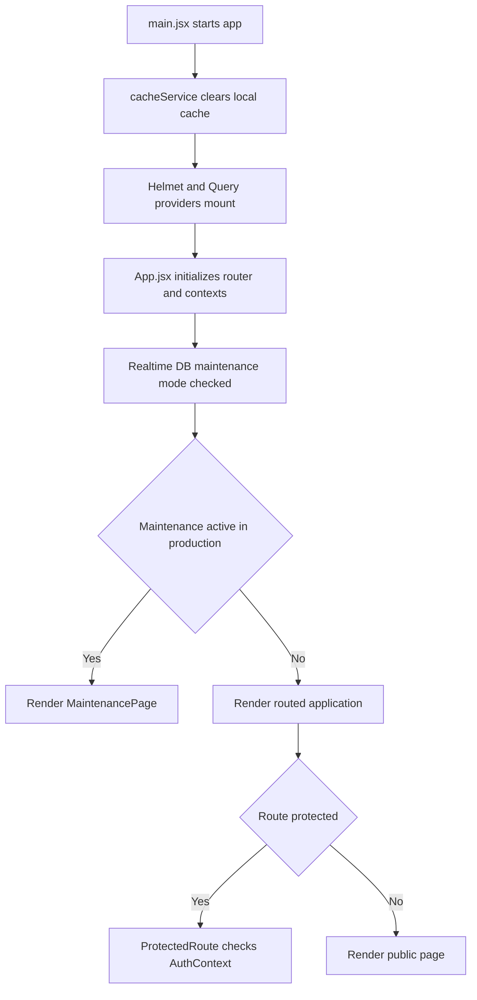

# Module 6: Platform Infrastructure, Authentication, and Shared Services

| VERSION | DATE | CREATOR | REVIEWER | ORGANIZATION |
|---------|------|---------|----------|--------------|
| 1.0 | 2026-03-09 | GitHub Copilot | TBD | Educare (Dada Chi Shala) Educational Trust |

## 1. Overview

### Business purpose in plain language

This module is the platform foundation of the application. It is responsible for startup behavior, routing, authentication, maintenance-mode handling, shared providers, query behavior, Firebase initialization, and deployment configuration that every business feature depends on.

### What the component does

- Boots the React application and mounts global providers.
- Initializes Firebase services and validates environment configuration.
- Defines the public and admin route map.
- Protects admin routes through authenticated navigation.
- Applies query defaults, caching behavior, SEO support, notification behavior, and error handling.
- Supports a Realtime Database maintenance-mode toggle for production shutdown control.

### When it executes

- Immediately on application startup.
- On every route navigation.
- On every authentication-state change.
- On browser refresh when cache cleanup and provider initialization run.

## 2. Components

### 2.1 Business Overview

This module is not directly user-facing in business terms, but it is the operational backbone that keeps all user-facing modules available, secure, and maintainable. Any defect in this area can block the entire application or weaken access control.

### 2.1.1 Process Flow

#### Step-by-step system journey

1. `main.jsx` clears namespaced cache state to prevent stale data after full reload.
2. The app mounts `HelmetProvider` and `QueryProvider`.
3. `App.jsx` wraps the UI with `AuthProvider` and `NotificationProvider`.
4. `App.jsx` reads `config/maintenanceMode` from Realtime Database.
5. If production maintenance mode is true, the app serves `MaintenancePage` instead of normal routes.
6. Otherwise the router resolves the requested page, which is lazy-loaded through `React.lazy` and `Suspense`.
7. For admin dashboard routes, `ProtectedRoute.jsx` checks `useAuth()` state.
8. `AuthContext.jsx` maintains user state using Firebase Auth and `onAuthStateChanged()`.
9. Shared query configuration, logging, SEO, notification display, and scroll reset continue to operate across route changes.

### 2.1.2 Functional Requirements

| ID | Requirement | Acceptance Criteria | Business Rules |
|----|-------------|--------------------|----------------|
| FR-PI-01 | The system must initialize the application with global providers. | React app mounts with query, helmet, auth, and notification providers available. | Provider order must support downstream hooks and route rendering. |
| FR-PI-02 | The system must expose the defined route map. | All configured public and admin routes resolve to the expected pages. | Unknown routes go to the not-found page. |
| FR-PI-03 | The system must restrict admin dashboard access to authenticated users. | Unauthenticated access to `/admin/dashboard` redirects to `/admin/login`. | Authentication status must be resolved before protected content renders. |
| FR-PI-04 | The system must support a production maintenance switch. | When `config/maintenanceMode` is true in production, the maintenance page is shown. | Admin access is intentionally bypassed only by existing route logic outside maintenance screen handling. |
| FR-PI-05 | The system must initialize Firebase services from environment variables. | Firebase services become available and missing variables are logged clearly. | Missing required variables should be visible in logs even if the app continues to start. |

### 2.1.3 Non-Functional Requirements

- Availability: The app should fail gracefully when analytics or maintenance reads fail.
- Security: Auth, env vars, and route guarding must prevent accidental admin exposure.
- Observability: Initialization errors must be visible in browser logs.
- Performance: Route-level code splitting should keep startup lean.
- Maintainability: Shared services should provide one obvious place to adjust cache, query, and auth behavior.

### 2.1.4 Technical Breakdown

#### Component and file structure

Startup and routing:
- `src/main.jsx`
- `src/App.jsx`

Authentication and protection:
- `src/context/AuthContext.jsx`
- `src/components/ProtectedRoute.jsx`
- `src/pages/AdminLogin.jsx`

Shared shell and UX utilities:
- `src/components/Navbar.jsx`
- `src/components/Footer.jsx`
- `src/components/ScrollToTop.jsx`
- `src/components/ErrorBoundary.jsx`
- `src/components/SEO.jsx`
- `src/context/NotificationContext.jsx`

Config and services:
- `src/services/firebase.js`
- `src/config/queryClient.jsx`
- `src/services/cacheService.js`
- `src/utils/adminSetup.js`
- `src/utils/logger.js`
- `src/utils/helpers.js`
- `src/utils/validators.js`
- `src/utils/sanitization.js`
- `src/config/colors.js`

Build and deployment files:
- `package.json`
- `vite.config.js`
- `tailwind.config.js`
- `postcss.config.cjs`
- `firebase.json`
- `vercel.json`

#### Methods, public methods, and on-load behavior

Important public exports:
- `AuthProvider`, `useAuth()`
- `QueryProvider`, `queryClient`
- Firebase exports `db`, `rtdb`, `auth`, `storage`, `functions`, `analytics`
- `showNotification`, `showSuccess`, `showError`, `showWarning`, `showInfo`

On load behavior:
- Clears namespaced app cache.
- Initializes router and lazy page definitions.
- Subscribes to auth state changes.
- Subscribes to Realtime Database maintenance-mode changes.

#### Imported functions

- `onAuthStateChanged`, `signInWithEmailAndPassword`, `signOut` from Firebase Auth
- `ref`, `onValue` from Firebase Realtime Database
- `initializeApp`, `getFirestore`, `getDatabase`, `getFunctions`, `getStorage`, `getAnalytics`
- `QueryClient`, `QueryClientProvider`

#### Security considerations

- Missing or weak Firestore rules are the main systemic risk if not enforced outside this repository.
- Client-side `ProtectedRoute` is necessary but not sufficient for backend authorization.
- Environment variables for Firebase and other integrations must not leak secrets beyond the intended public keys.
- Maintenance mode path in Realtime Database should be writable only by trusted operators.

#### Performance analysis

- Lazy-loaded routes reduce initial bundle size.
- Query defaults enable controlled retry and refetch behavior.
- Cache clearing on every hard refresh improves freshness but sacrifices persistence benefits from previous sessions.
- Notification rendering is lightweight and does not materially affect startup.

## 3. Related Objects and Automation

### All DB related operations

- Read `config/maintenanceMode` from Realtime Database.
- Subscribe to Firebase Auth state.
- Initialize Firestore, Storage, Functions, and Analytics clients.
- Clear app-managed local cache on startup.

### Primary tables involved

Realtime Database paths:
- `config/maintenanceMode`

Platform services:
- Firebase Auth
- Firestore
- Storage
- Cloud Functions
- Analytics

### Child records created

- No business child records are created directly by infrastructure startup logic.
- Authentication sessions and browser-side cache entries are created and managed implicitly by platform SDKs and `cacheService`.

## 4. Impacted Components

### All files impacted directly and indirectly

Direct files:
- `src/main.jsx`
- `src/App.jsx`
- `src/context/AuthContext.jsx`
- `src/context/NotificationContext.jsx`
- `src/components/ProtectedRoute.jsx`
- `src/components/ErrorBoundary.jsx`
- `src/components/ScrollToTop.jsx`
- `src/components/Navbar.jsx`
- `src/components/Footer.jsx`
- `src/services/firebase.js`
- `src/config/queryClient.jsx`
- `src/services/cacheService.js`

Indirect files:
- All `src/pages/*` via routing
- All `src/hooks/*` via query configuration
- All `src/services/*` via Firebase client initialization
- Root build and hosting configuration files

### Impact analysis

- Changes in `App.jsx` or `main.jsx` affect the entire site, including routing, auth, and maintenance behavior.
- Query-client changes alter fetch behavior across all modules.
- Firebase bootstrap changes can break every data-dependent feature simultaneously.
- Weak route protection or auth-state logic will expose or block admin areas globally.

## 5. For Administrators / Technical Teams

### Configuration requirements

- `.env` must include all required Firebase variables referenced in `src/services/firebase.js`.
- Realtime Database must contain a readable `config/maintenanceMode` path if maintenance control is used.
- Auth providers and admin accounts must be configured in Firebase Auth.
- Hosting configuration in `firebase.json` and `vercel.json` must preserve SPA routing.

### Permissions needed

- App runtime needs public Firebase initialization access.
- Admin users need Firebase Auth credentials.
- Only trusted operators should be able to change maintenance mode.

### Debug queries

- Realtime Database read on `config/maintenanceMode`
- Firebase Auth current-user state inspection

### Debug log setup instructions

- Watch browser console for missing environment variable messages from Firebase bootstrap.
- Verify auth-state transitions through login and logout flows.
- Check console warnings when analytics initialization or maintenance-mode reads fail.

### Common system issues

- Missing Firebase environment variables causing startup instability.
- Admin route redirect loops caused by auth state not resolving.
- Entire site showing maintenance page because `maintenanceMode` is enabled in production.
- Stale data confusion because cache is cleared only on hard refresh, not every route change.

### Troubleshooting steps

1. Confirm all required `VITE_FIREBASE_*` variables are present.
2. Verify Firebase Auth can sign in and restore sessions on refresh.
3. Check the Realtime Database value under `config/maintenanceMode`.
4. Validate that hosting rewrites still point unknown routes to `index.html`.
5. Inspect the browser console for initialization, auth, and query errors before troubleshooting feature modules.
